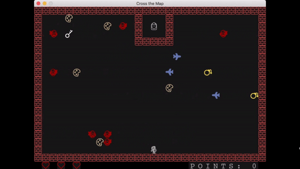
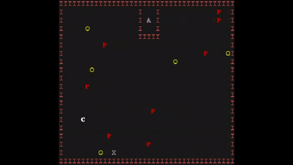
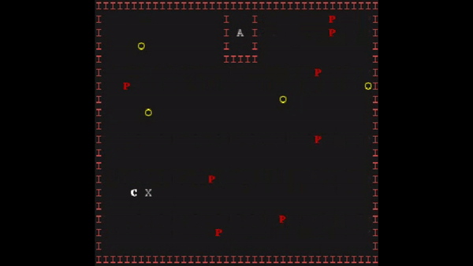
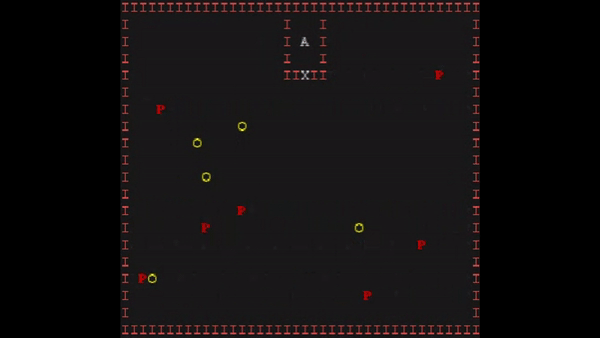
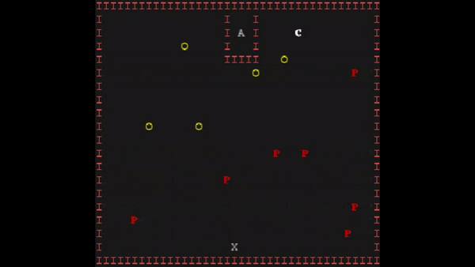
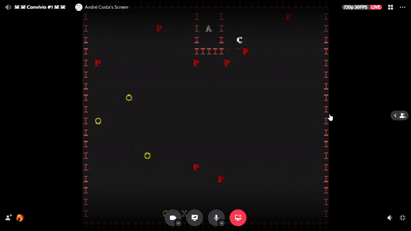

# LDTS_04_05 - Cross the Map

Our game consists in a text-based version of the Crossy Road game with some SuperMario combinations and some new characters.

The main character is Jack the Sparrow who is trying to free his Princess, and for that he needs to avoid the Pirates and collect the special key.

For the player to win the game with the highest score, it needs to catch all the biscuits, which represents the score, and the special key to open the prison door where the Princess is being kept.

After rescuing the Princess is opened and Jack needs to leave the map through that door.

Each biscuit that Jack catches makes his score go up, but these are not necessary to release the Princess and finish the game.

This project was developed by _André Costa_ (https://github.com/AndreCosta201905916) (up201905016@fe.up.pt) and _Francisco Serra_ (https://github.com/kiko-serra) (up202007723@fe.up.pt) and _Válter Castro_ (https://github.com/ValterCastro) (up201706546@fe.up.pt) for LDTS 2021⁄22.
## Index
* [Implemented Features](#implemented-features)
  * [Jack the Sparrow](#jack-the-sparrow)
  * [Pirates](#pirates)
  * [Princess](#princess)

## IMPLEMENTED FEATURES

### Jack the Sparrow

- **Movement** - The game character will move according to the direction of the arrow key pressed, and he can´t walk through the borders.

    

- **Getting biscuits** - When Jack hits a biscuit his score goes up by one biscuit until he reaches the maximum score.

    

- **Catching key** - For Jack to release his beloved Princess he needs to catch the key to open the prison door.

    

    

- **Lives** - Collisions are implemented so that each time Jack gets hit by one of the pirates he loses a life. When the game starts Jack has 3 lives, and if he loses them all he dies.

    

### Pirates

- **Movement** - Each pirate moves independently horizontally and when they hit a border their direction changes.

    

- **Removing lives** - Any Pirate that hits Jack removes one of the three lives he has.

## PLANNED FEATURES

- **Different Pirates** - We will make three kinds of Pirates, each one with different speeds and the bigger one will leave bombs behind.
- **Menu** - There will be a menu when you open the game with some buttons.
- **Personalized Font** - We'll create a new font to have our characters and some objects printed on the game.
- **Game Over** - After you die there will be a message on the screen saying that you've died and if you want to restart playing.
- **Lives abd score** - On the lower portion of the game will have the amount of lives remaining and how many biscuits you have caught.

### TESTING

- Screenshot of coverage report.
- Link to mutation testing report.

### SELF-EVALUATION

- André Costa: 
- Francisco Serra: 
- Válter Castro:
