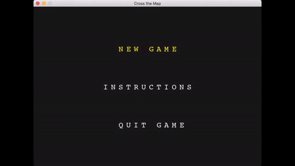
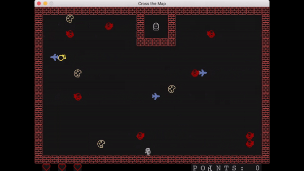
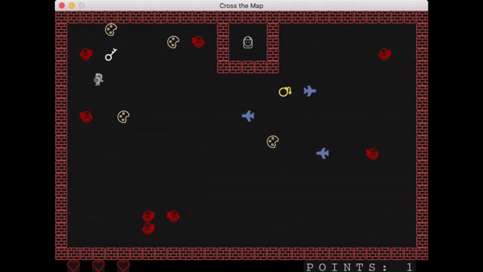
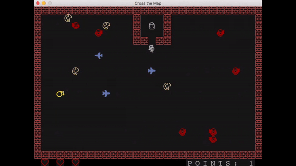
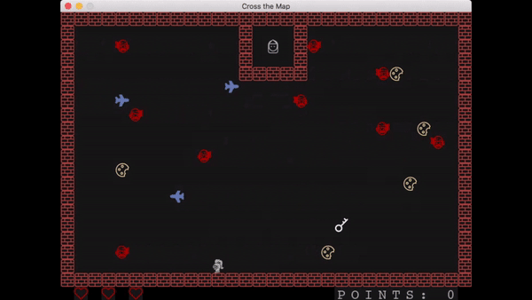
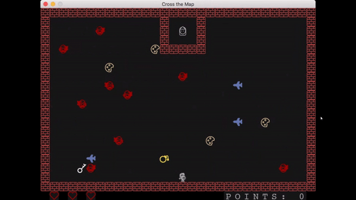
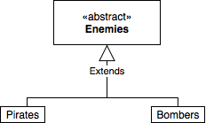
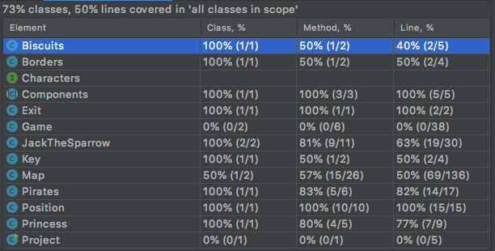

# LDTS_04_05 - Cross the Map

Our com.g0405.game consists in a text-based version of the Crossy Road com.g0405.game with some SuperMario combinations and some new characters.

The main character is Jack the Sparrow who is trying to free his Princess, and for that he needs to avoid the Pirates and all explosions from the bombs and collect the special key.

For the player to win the com.g0405.game with the highest score, it needs to catch all the biscuits, which represents the score, and the special key to open the prison door where the Princess is being kept.

After rescuing the Princess is opened and Jack needs to leave the map through that door.

Each biscuit that Jack catches makes his score go up, but these are not necessary to release the Princess and finish the com.g0405.game.

This project was developed by _André Costa_ (https://github.com/AndreCosta201905916) (up201905016@fe.up.pt) and _Francisco Serra_ (https://github.com/kiko-serra) (up202007723@fe.up.pt) and _Válter Castro_ (https://github.com/ValterCastro) (up201706546@fe.up.pt) for LDTS 2021⁄22.

## Index
* [GamePlay Demo](#gameplay-demo)
* [Implemented Features](#implemented-features)
  * [Jack the Sparrow](#jack-the-sparrow)
  * [Enemies](#enemies)
  * [Princess](#princess)
* [Planned Features](#planned-features)
* [Design](#design)
  * [Characters](#characters)
    * [Problem in Context](#problem-in-context)
    * [Pattern](#pattern)
    * [Implementation](#implementation)
    * [Consequences](#consequences)
  * [Enemies](#enemies-1)
    * [Problem in Context](#problem-in-context-1)
    * [Pattern](#pattern-1)
    * [Implementation](#implementation-1)
    * [Consequences](#consequences-1)
  * [Input](#input)
    * [Problem in Context](#problem-in-context-2)
    * [Pattern](#pattern-2)
    * [Implementation](#implementation-2)
    * [Consequences](#consequences-2)
* [Code Smells and Possible Refactorings](#code-smells-and-possible-refactorings)
  * [Large Class](#large-class)
* [Testing](#testing)
  * [Coverage Report](#coverage-report)
* [Self-Evaluation](#self-evaluation)

## GamePlay Demo

    

## Implemented Features

### Jack the Sparrow

- **Movement** - The com.g0405.game character will move according to the direction of the arrow key pressed, and he can´t walk through the borders.

    

- **Getting biscuits** - When Jack hits a biscuit his score goes up by one biscuit until he reaches the maximum score.

    

- **Catching key** - For Jack to release his beloved Princess he needs to catch the key to open the prison door.

    

    

- **Lives** - Collisions are implemented so that each time Jack gets hit by one of the pirates he loses a life. When the com.g0405.game starts Jack has 3 lives, and if he loses them all he dies.

    

### Enemies

- **Movement** - Each enemy moves independently horizontally and when they hit a border their direction changes. Bomber planes will randomly drop bombs.

    

- **Removing lives** - Any Enemy that hits Jack removes one of the three lives he has. If Jack is nearby a bomb explosion, he will also lose one life.

### Princess

- **Following Jack** - When Jack enters the prison, the Princess will start following until they leave the map.

    

## Planned Features

- **Different Pirates** - We will make three kinds of Pirates, each one with different speeds and the bigger one will leave bombs behind.
- **Menu** - There will be a menu when you open the com.g0405.game with some buttons.
- **Personalized Font** - We'll create a new font to have our characters and some objects printed on the com.g0405.game.
- **Game Over** - After you die there will be a message on the screen saying that you've died and if you want to restart playing.
- **Lives and score** - On the lower portion of the com.g0405.game will have the amount of lives remaining and how many biscuits you have caught.
- **Sounds and music** - There will be background music and each time Jack catches anything a sound will be played.

## Design

### Enemies

#### Problem in Context
Our game had two different enemies that behaved very similarly. It is like the game had two variants of an enemy.

#### Pattern
We implemented the **Abstract Factory Pattern**. It suggests an implementation of an individual enemy so that the different enemies belong to the same family. 
We chose an abstract class because they have the same interaction with some changes.
#### Implementation

    

#### Consequences
* More classes.
* Override the draw method.
* Less repetitive code.

### Components

#### Problem in Context
Similarly to the enemies' problem our game had many components that used the same methods. 

#### Pattern
We implemented the **Abstract Factory Pattern**. It suggests an implementation of an individual component so that the different components belong to the same family.
We chose an abstract class because they have the same methods.
#### Implementation

    

#### Consequences
* More classes.
* Less repetitive code.

### Characters

#### Problem in Context
Since the beginning we knew we would have a lot of moving characters in our game and even if they don't act all the same way there are only some subtle changes.
#### Pattern
With this in mind we decided to use the **Factory Method** to help us design our code in a better way. Implemented an interface with all common methods to every character.
#### Implementation

    

#### Consequences
* One additional interface.
* Code organization improved.

## Code Smells and Possible Refactorings
### Bloaters - Large Class

Our classes Game and Map contain many fields and methods.
In both cases, we find it justifiable as the classes require these fields,
in one hand the Game class is the main class of the program and it needs to store a considerable amount of data,
on the other hand with a different code structure, it could have fewer methods and be more organized (extract method).

In Map there are a lot of methods that are necessary. Method related to everything that happens during our Game time and that deal with different classes.
Some methods could be **extracted**. 

### Couplers - Feature Envy
In Map there are some methods that could be **extracted** but since they require information about other classes
we don't **extract** them to keep our relations simpler. There are cases where we could use inline methods in various larger methods to keep them smaller and with less duplicate code.

## Testing

### Coverage Report

    

## Self-Evaluation

- André Costa: 
- Francisco Serra: 
- Válter Castro:
